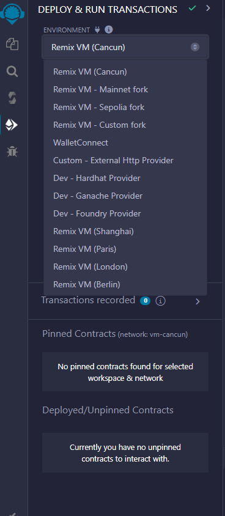
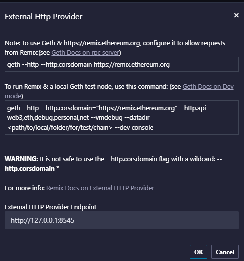
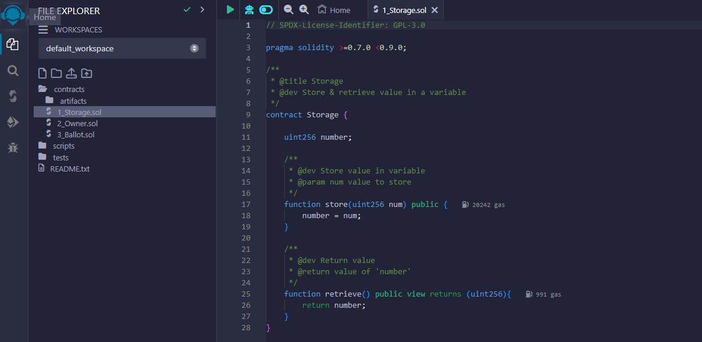

# Laboratorium Blockchain

## Przygotowanie stanowiska

```bash
sudo apt-get update
sudo apt-get -y install make

# install golang
wget https://go.dev/dl/go1.22.3.linux-amd64.tar.gz
rm -r /usr/local/go && sudo tar -C /usr/local -xzf go1.22.3.linux-amd64.tar.gz

# install ethereum client
wget https://github.com/ethereum/go-ethereum/archive/refs/tags/v1.13.15.tar.gz
tar -xzf v1.13.15.tar.gz
cd go-ethereum-1.13.15/
make geth
sudo cp ./build/bin/geth /usr/bin

```

## Przeglądanie istniejących bloków blockchain łańcuchów Bitcoin i Ethereum

-   Obserwacja bloków sieci Bitcoin
    
    -   [https://www.blockchain.com/explorer](https://www.blockchain.com/explorer "https://www.blockchain.com/explorer")
        
    -   [https://blockchain.info/rawblock/](https://blockchain.info/rawblock/ "https://blockchain.info/rawblock/")
        
-   Obserwacja transakcji
    

## Uruchomienie klienta Ethereum

### Pobieranie pliku genesis.json

```bash
curl -s https://pastebin.com/raw/BpcfSpb5 > genesis.json
```

### Utworzenie portfela

```bash
geth account new
```

> ZAPISZ SWÓJ ADRES!!

### Uruchomienie klienta Ethereum

```bash
geth init genesis.json

geth --networkid 12345 --bootnodes '<WARTOŚĆ ZOSTANIE PODANA NA LABORATORIUM>' --ethstats '<TUTAJ WPISZ NUMER ALBUMU>:bst2024@20.82.150.84' --unlock '<ADRES WASZEGO PORTFELA>' --allow-insecure-unlock --http --http.corsdomain="*" --http.api web3,eth,debug,personal,net
```

> Okno terminala z klientem Ethereum pozostaw włączone bez przerwy!

> Sprawdź czy twój klient jest dostępny na stronie  [http://20.82.150.84/](http://20.82.150.84/ "http://20.82.150.84/")  i czy ma wartość różną od 0 w numerze aktualnego bloku.

### Uruchomienie konsoli klienta Ethereum

> Uruchom konsolę w nowym terminalu

```bash
geth attach $HOME/.ethereum/geth.ipc
```

#### Pomocne komendy wewnątrz konsoli Ethereum:

-   Sprawdzenie stanu konta

```javascript
eth.getBalance("ADRES PORTFELA")
```

-   Utworzenie transakcji

```javascript
eth.sendTransaction({from: "<ADRES>", to: "<ADRES>", value: <WARTOSC>})
```

-   Podejrzenie transakcji

```javascript
eth.getTransaction("<HASH TRANSAKCJI>")
```

-   Zmiana jednostki

```javascript
eth.fromWei(<WARTOSC>)
eth.toWei(<WARTOSC>)
```

### Operowanie funduszami

1.  Wejdź na stronę  [http://20.82.150.84:8080/](http://20.82.150.84:8080/ "http://20.82.150.84:8080/")
    
2.  Wklej adres swojego portfela i pobierz dla siebie 5 BSTEthereum.
    
3.  Sprawdź stan swojego konta
    -   Dlaczego wartość jest taka duża?
4.  Za pomocą konsoli prześlij drobną kwotę innemu uczestnikowi laboratorium
    
5.  Ponownie sprawdź stan swojego konta
    -   Czy stan twojego konta jest zgodny z oczekiwaniami?
    -   Gdzie podziały się brakujące fundusze?
6.  W konsoli wyświetl wszystkie dane z transakcji utworzonej przez Ciebie
    
7.  Spróbuj wysłać część swoich funduszy na nieistniejący adres. ([https://vanity-eth.tk/](https://vanity-eth.tk/ "https://vanity-eth.tk/")  generator adresów tymczasowych)
    -   Czy klient zablokował możliwość wysłania funduszy na nieistniejący adres?

## Solidity

### Przygotowanie
1. Uruchom środowisko deweloperskie: https://remix.ethereum.org/ 
2. Skonfiguruj klienta `geth` zgodnie z instrukcją po kliknięciu w `Custom - External Http Provider`.




### Wdrożenie pierwszego kontraktu
1. Przeanalizuj kod źródłowy kontraktu 1_Storage.sol

2. Skompiluj kontrakt 1_Storage.sol i spróbuj go wdrożyć w sieci. 
3. Uruchom obie metody kontraktu kilka razy. Spróbuj też uruchomić kontrakt wdrożony przez inną osobę.

    - Czy działanie jest zgodne z oczekiwaniami? 
    - Gdzie przechowywane są zmienne kontraktu? 
    - Sprawdź stan swojego konta. 
    - Gdzie podziały się brakujące BSTEtherum?
### Drugi kontrakt
1. Skompiluj kontrakt 2_Owner.sol i wdróż go w sieci BSTEthereum. 
2. Uruchom metodę setOwner(). 
3. Poproś innego uczestnika, aby uruchomił tą samą metodę ze swoim adresem. 
4. Zmodyfikuj kontrakt 2_Owner.sol w taki sposób, aby tylko aktualny właściciel mógł zmienić właściciela kontraktu. 
5. Przetestuj twój kontrakt

   - Czy możesz zmienić właściciela kontraktu na nieistniejący adres? 
   - Co zrobić w takiej sytuacji? Czy można usunąć już wdrożony kontrakt?

## Źródła

-   Generator adresów:  [https://vanity-eth.tk/](https://vanity-eth.tk/ "https://vanity-eth.tk/")
-   Solidity - dokumentacja:  [https://docs.soliditylang.org/en/v0.8.26/](https://docs.soliditylang.org/en/v0.8.26/ "https://docs.soliditylang.org/en/v0.8.26/")
-   Przykłady kodu Solidity:  [https://solidity-by-example.org/](https://solidity-by-example.org/ "https://solidity-by-example.org/")
-   Dokumentacja Ethereum:  [https://geth.ethereum.org/docs/](https://geth.ethereum.org/docs/ "https://geth.ethereum.org/docs/")
-   Ethereum Yellow Paper:  [https://ethereum.github.io/yellowpaper/paper.pdf](https://ethereum.github.io/yellowpaper/paper.pdf "https://ethereum.github.io/yellowpaper/paper.pdf")

## Wartości na laby

### BOOTNODE:

`enode://d852e25a43b1803d1b0f390ab88ddce690bb52bb26b5dd6718af7e7b56e425592076c4b312492a19e962740b0685d2e8a8a4f10e6bc15bac11942bd17e8ed969@20.82.150.84:30303`

### SEALER:

`enode://288b97262895b1c7ec61cf314c2e2004407d0a5dc77566877aad1f2a36659c8b698f4b56fd06c4a0c0bf007b4cfb3e7122d907da3b005fa90e724441902eb19e@20.82.150.84:30304`

## Jeżeli nie działa:

### Aktualizowanie bloku

`admin.addPeer("enode://288b97262895b1c7ec61cf314c2e2004407d0a5dc77566877aad1f2a36659c8b698f4b56fd06c4a0c0bf007b4cfb3e7122d907da3b005fa90e724441902eb19e@20.82.150.84:30304")`